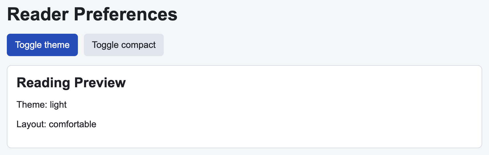

# Problem 2: React Context for Reading Preferences

Edit `Lesson 1.2/main-2.jsx`:

Use React context to share reading preferences with nested components.

Within the file:

1. Create `PreferencesContext` with `React.createContext(null)`
2. Create a `PreferencesProvider` component
3. Store `theme` state in the provider with the starting value `"light"`
4. Store `compact` state in the provider with the starting value `false`
5. Pass `theme`, `compact`, `toggleTheme`, and `toggleCompact` through the context provider value
6. Use `React.useContext(PreferencesContext)` in `Toolbar`
7. Use `React.useContext(PreferencesContext)` in `PreviewPanel`
8. Make `Toggle theme` switch between `light` and `dark`
9. Make `Toggle compact` switch between `comfortable` and `compact`
10. In `PreviewPanel`, build the panel's `className` from the `preview-panel` class plus the current theme value (`light` or `dark`), and add the `compact` class only when compact mode is on. Also render the current theme next to a `Theme:` label and the current layout word (`comfortable` or `compact`) next to a `Layout:` label

Context is useful when several nested components need the same shared state without passing every value through every intermediate component.

The resulting page should look similar to this image:

---

Course 4, Module 3 - practice assignment (ungraded): [Practice: State Across Components](https://www.coursera.org/learn/building-applications-with-react/programming/412bq/practice-state-across-components) - `Lesson 1.2`

The files here are the starter you get in the course. The finished `main-2.jsx` is in the [solution folder on GitHub](https://github.com/soney/Practical-JavaScript/tree/main/assignments/Course%204/Module%203/Lesson%201/Lesson%201.2/solution); in the course codespace that folder is hidden so you can work the problem first.
