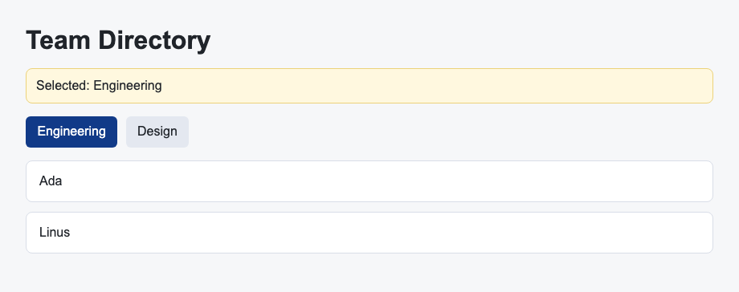

# Problem 3: Callback Props for Department Tabs

Edit `Lesson 1.3/main-3.jsx`:

Lift the selected department state into `App` and pass a callback prop to the tab buttons.

Within the file:

1. Update `DepartmentTabs` so it accepts `selectedDepartment` and `onSelectDepartment` props.
2. In `DepartmentTabs`, add `onClick={() => onSelectDepartment(department)}` to each department button.
3. In `DepartmentTabs`, give the selected department button the class `active`.
4. Give non-selected department buttons the class `secondary`.
5. In `App`, pass `selectedDepartment` to `DepartmentTabs`.
6. In `App`, pass `setSelectedDepartment` as the `onSelectDepartment` prop.
7. Keep `MemberList` using the shared `selectedDepartment` state from `App`.

This follows the shared-state lesson: keep the state in the nearest common parent, then pass values and callback props to child components.

The resulting page should look similar to this image:

---

Course 4, Module 3 - practice assignment (ungraded): [Practice: State Across Components](https://www.coursera.org/learn/building-applications-with-react/programming/412bq/practice-state-across-components) - `Lesson 1.3`

The files here are the starter you get in the course. The finished `main-3.jsx` is in the [solution folder on GitHub](https://github.com/soney/Practical-JavaScript/tree/main/assignments/Course%204/Module%203/Lesson%201/Lesson%201.3/solution); in the course codespace that folder is hidden so you can work the problem first.
