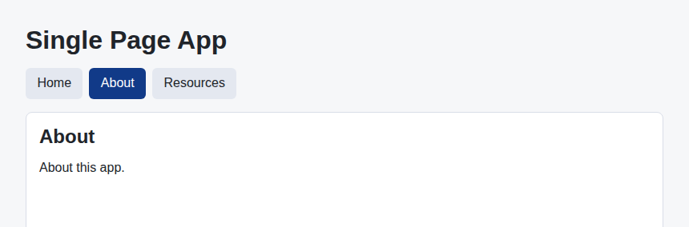

# Problem 1: React Router for Single-Page Navigation

Edit `Lesson 2.1/main-1.jsx`:

Build a small single-page app with the real `react-router-dom` library instead of hand-rolling navigation. The library is already loaded for you, and the line that destructures `HashRouter`, `Switch`, `Route`, and `NavLink` from the global `ReactRouterDOM` object is provided at the top of the file.

Within the file:

1. Wrap the returned markup in a `HashRouter`. `HashRouter` keeps the routes in the URL hash so the app works when the page is opened directly as a file.
2. Replace the three `a` elements with `NavLink` elements that point `to` `"/"`, `"/about"`, and `"/resources"`.
3. Give each `NavLink` the prop `activeClassName="active"` so the current link gets the `active` class. Add `exact` to the `"/"` link so it is only active on the home route.
4. Add a `Switch` that contains a `Route` for each page:
   - `path="/"` (with `exact`) renders `HomePage`
   - `path="/about"` renders `AboutPage`
   - `path="/resources"` renders `ResourcesPage`
5. Keep all page changes inside the router instead of navigating to another HTML file.

`react-router-dom` maps URLs to components, which is how real React single-page apps handle navigation.

The resulting page should look similar to this image, shown here after clicking "About": the panel now shows the About page and the "About" link is highlighted, all without the page reloading.

## Library documentation

This assignment uses React Router v5. Its API (`HashRouter`, `Switch`, and `NavLink` with `activeClassName`) is specific to v5 and differs from the current v6 and v7 releases, so use the version-matched links below.

- react-router-dom 5.3.4: [documentation (v5)](https://v5.reactrouter.com/web/guides/quick-start), [npm package](https://www.npmjs.com/package/react-router-dom/v/5.3.4), [github (tag v5.3.4)](https://github.com/remix-run/react-router/tree/v5.3.4)

---

Course 4, Module 3 - practice assignment (ungraded): [Practice: Common React Libraries and Patterns](https://www.coursera.org/learn/building-applications-with-react/programming/LQTWD/practice-common-react-libraries-and-patterns) - `Lesson 2.1`

The files here are the starter you get in the course. [`solution/main-1.jsx`](solution/main-1.jsx) is the finished `main-1.jsx`; copy it over the starter to run the completed assignment.
