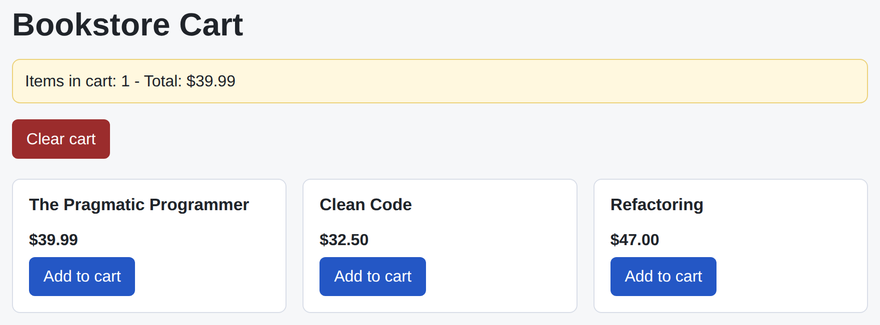

# Problem 2: Sharing Cart State with a Zustand Store

Edit `Lesson 2.2/main-2.jsx`:

Share one shopping cart across two separate components with the real `zustand` state-management library instead of passing the cart through props. The library is already loaded for you, and the line that reads `create` from the global `zustand` object is provided at the top of the file. A `PRODUCTS` list, a `formatPrice` helper (which turns a dollar amount into a string like `$39.99`), and the `App` layout are also provided.

The store is the single source of truth for the cart. `Product` (which adds books) and `CartSummary` (which shows the running total) both reach into the same store, so neither one has to pass cart data to the other.

Within the file:

1. Finish the `useCartStore` store. `create` receives a `set` function and returns the store object. Give the two actions real bodies:
   - `addItem(book)` adds `book` to the end of `items` (use `set` with the current `state`, and do not mutate the old array).
   - `clearCart()` resets `items` to an empty array.
2. In `CartSummary`, read the cart from the store with selectors: `useCartStore((state) => state.items)` for the items and `useCartStore((state) => state.clearCart)` for the action. The count already shows in the `.cart-count` element and `total` is already computed for you. To display the total in the `.cart-total` element, do not format the number by hand -- pass `total` to the provided helper and render the result, i.e. `formatPrice(total)`, which gives a string like `$39.99`. Finally, make the `Clear cart` button call `clearCart`.
3. In `Product`, read the `addItem` action with a selector (`useCartStore((state) => state.addItem)`) and make the `Add to cart` button call `addItem(book)`.

Because both components subscribe to the same store, clicking `Add to cart` on any book updates the summary immediately, with no shared parent state and no prop drilling.

The resulting page should look similar to this image, shown here after adding one book to the cart:

## Library documentation

- zustand 5.0.14: [documentation](https://zustand.docs.pmnd.rs/learn/getting-started/introduction), [npm package](https://www.npmjs.com/package/zustand/v/5.0.14), [github (tag v5.0.14)](https://github.com/pmndrs/zustand/tree/v5.0.14)

---

Course 4, Module 3 - practice assignment (ungraded): [Practice: Common React Libraries and Patterns](https://www.coursera.org/learn/building-applications-with-react/programming/LQTWD/practice-common-react-libraries-and-patterns) - `Lesson 2.2`

The files here are the starter you get in the course. [`solution/main-2.jsx`](solution/main-2.jsx) is the finished `main-2.jsx`; copy it over the starter to run the completed assignment.
