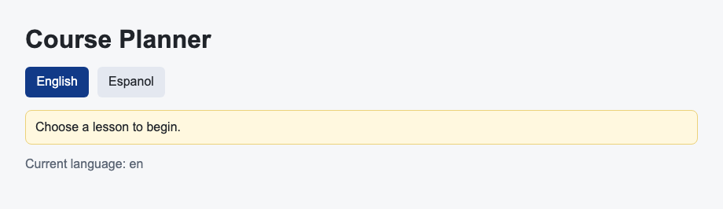

# Problem 3: i18next Translations for Language Switching

Edit `Lesson 2.3/main-3.jsx`:

Switch the rendered text between languages with the real `i18next` and `react-i18next` libraries instead of a hand-rolled dictionary. Both libraries are already loaded (`i18next` is on the global `i18next` object), and the line that destructures `I18nextProvider` and `useTranslation` from the global `ReactI18next` object is provided at the top of the file.

Within the file:

1. Create an instance with `i18next.createInstance()` and call `i18n.init(...)`. Pass:
   - `lng: "en"`
   - a `resources` object with an `en` and an `es` entry, each holding a `translation` object with a `heading` and a `message` string. Use these exact strings:
     - `en`: `heading` is `Course Planner`, `message` is `Choose a lesson to begin.`
     - `es`: `heading` is `Planificador del curso`, `message` is `Elige una leccion para comenzar.`
2. In `Planner`, read `t` and `i18n` from `useTranslation()`.
3. Render the heading with `t("heading")` and the status line with `t("message")`.
4. Make the `English` button call `i18n.changeLanguage("en")` and the `Espanol` button call `i18n.changeLanguage("es")`.
5. Give the selected language button the class `active` and the other the class `secondary`. Use `i18n.language` to decide which is selected, and keep showing it in the `Current language:` paragraph.
6. In `App`, wrap `Planner` in an `I18nextProvider` that receives your `i18n` instance.

Real React apps load translated strings from `i18next` resources instead of hard-coding one language throughout the component.

The resulting page should look similar to this image:

## Library documentation

- i18next 23.16.8: [documentation](https://www.i18next.com/overview/getting-started), [npm package](https://www.npmjs.com/package/i18next/v/23.16.8), [github (tag v23.16.8)](https://github.com/i18next/i18next/tree/v23.16.8)
- react-i18next 13.5.0: [documentation](https://react.i18next.com/), [npm package](https://www.npmjs.com/package/react-i18next/v/13.5.0), [github (tag v13.5.0)](https://github.com/i18next/react-i18next/tree/v13.5.0)

---

Course 4, Module 3 - practice assignment (ungraded): [Practice: Common React Libraries and Patterns](https://www.coursera.org/learn/building-applications-with-react/programming/LQTWD/practice-common-react-libraries-and-patterns) - `Lesson 2.3`

The files here are the starter you get in the course. [`solution/main-3.jsx`](solution/main-3.jsx) is the finished `main-3.jsx`; copy it over the starter to run the completed assignment.
