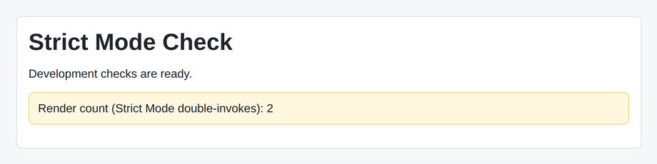

# Problem 1: Strict Mode for React Checks

Edit `Lesson 3.1/main-1.jsx`:

Wrap the app in React Strict Mode for development checks.

Strict Mode does not add any visible UI of its own. To make its effect observable, the starter keeps a `renderCount` variable that goes up by 1 each time `App` renders, and the page displays that count. In development, `React.StrictMode` renders your components an extra time to help surface bugs, so once `App` is wrapped, the count shown on the page changes from 1 to 2.

At the bottom of the file:

1. Keep using `ReactDOM.createRoot(document.querySelector("#root"))`.
2. Change the `.render(...)` call so it renders `<React.StrictMode>`.
3. Place `<App />` inside `<React.StrictMode>`.
4. Close the `React.StrictMode` element inside the render call.
5. Do not change the `App` component or the `renderCount` logic.

When Strict Mode is active, the line `Render count (Strict Mode double-invokes): 2` should appear on the page. Without Strict Mode the same line reads `1`.

The resulting page should look similar to this image:

---

Course 4, Module 3 - practice assignment (ungraded): [Practice: Debugging and Deploying Applications](https://www.coursera.org/learn/building-applications-with-react/programming/huxie/practice-debugging-and-deploying-applications) - `Lesson 3.1`

The files here are the starter you get in the course. The finished `main-1.jsx` is in the [solution folder on GitHub](https://github.com/soney/Practical-JavaScript/tree/main/assignments/Course%204/Module%203/Lesson%203/Lesson%203.1/solution); in the course codespace that folder is hidden so you can work the problem first.
