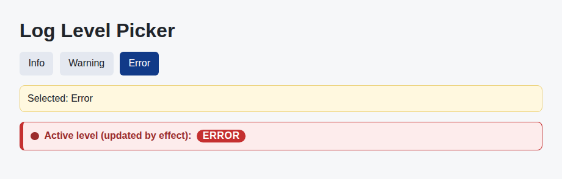

# Problem 2: Effect Dependencies for a Log Level Picker

Edit `Lesson 3.2/main-2.jsx`:

Fix the effect dependency array so the on-screen output stays correct when state changes.

`LogLevelPicker` shows three buttons (`Info`, `Warning`, `Error`) and two lines. The `Selected` line reads directly from the `selectedLevel` state, so it updates the moment you click a button, and the button you clicked is highlighted. The `Active level (updated by effect):` line is written by a `React.useEffect` that copies `selectedLevel` into a second state value, `activeLevel`. Right now that effect has an empty dependency array (`[]`), so it runs only once. When you click `Warning` or `Error`, the `Selected` line changes but the `Active level` line stays stuck on `Info`. That mismatch is the visible bug.

The `Active level` line is color-coded by level (blue for `Info`, amber for `Warning`, red for `Error`) so you can tell the three settings apart at a glance. That styling is already provided for you, so you do not need to add it. While the bug is present, the color difference between the two lines makes the mismatch stand out; after the fix, the `Active level` line changes color to match the level you selected.

Within `LogLevelPicker`:

1. Keep both `selectedLevel` and `activeLevel` state variables.
2. Keep the effect that calls `setActiveLevel(selectedLevel)`.
3. Change the effect dependency array from `[]` to `[selectedLevel]` so the effect runs again whenever `selectedLevel` changes.
4. Do not remove the `setActiveLevel(selectedLevel)` call.
5. Keep all three buttons updating `selectedLevel` (the selected button stays highlighted).

React lint feedback often points out missing effect dependencies. The dependency array should list the state values that the effect reads. After the fix, clicking `Error` updates both lines to `Error`.

The resulting page should look similar to this image, which shows the state after selecting `Error` (the selection that stays broken in the starter): the `Error` button is highlighted, both lines read `Error`, and the `Active level` line is color-coded red to match the `Error` level.

---

Course 4, Module 3 - practice assignment (ungraded): [Practice: Debugging and Deploying Applications](https://www.coursera.org/learn/building-applications-with-react/programming/huxie/practice-debugging-and-deploying-applications) - `Lesson 3.2`

The files here are the starter you get in the course. [`solution/main-2.jsx`](solution/main-2.jsx) is the finished `main-2.jsx`; copy it over the starter to run the completed assignment.
