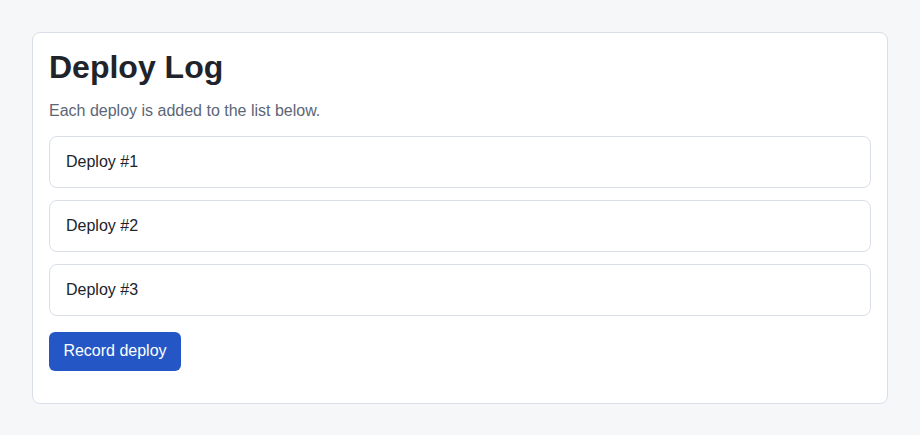

# Problem 3: Fix a State Mutation Bug When Adding to a List

Edit `Lesson 3.3/main-3.jsx`:

The `DeployLog` component keeps a list of recorded deploys in state and shows a `Record deploy` button. Clicking the button is supposed to add a new entry to the list, but there is a bug: clicking appears to do nothing. Your job is to fix that bug.

The bug is in the `recordDeploy` function. It calls `deploys.push(next)`, which changes the existing array in place, and then passes that same array to `setDeploys`. React decides whether to re-render by checking whether the value you pass to the setter is a NEW array. Because `push` reuses the same array, React sees no change and does not re-render, so the new entry never appears on the page.

Within `recordDeploy`:

1. Keep the line that computes `next` (the text for the new entry).
2. Remove the `deploys.push(next)` line and the `setDeploys(deploys)` line.
3. Replace them with a single `setDeploys` call that passes a brand-new array: spread the existing `deploys` and add `next` at the end, like `setDeploys([...deploys, next])`.
4. Do not change the rest of the component (the state, the list, or the button).

The `[...deploys, next]` spread copies the existing entries into a new array and adds `next`, so React can tell the value changed and re-renders the list. After the fix, each click on `Record deploy` adds one entry.

After clicking `Record deploy` once with the bug fixed, the page should look similar to this image. A third entry, `Deploy #3`, now appears in the list:

---

Course 4, Module 3 - practice assignment (ungraded): [Practice: Debugging and Deploying Applications](https://www.coursera.org/learn/building-applications-with-react/programming/huxie/practice-debugging-and-deploying-applications) - `Lesson 3.3`

The files here are the starter you get in the course. [`solution/main-3.jsx`](solution/main-3.jsx) is the finished `main-3.jsx`; copy it over the starter to run the completed assignment.
