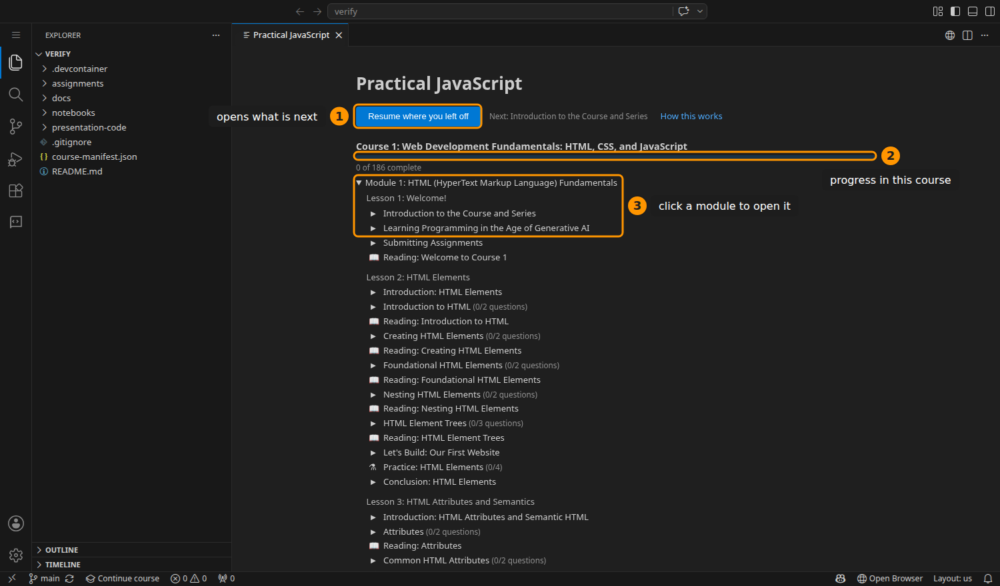
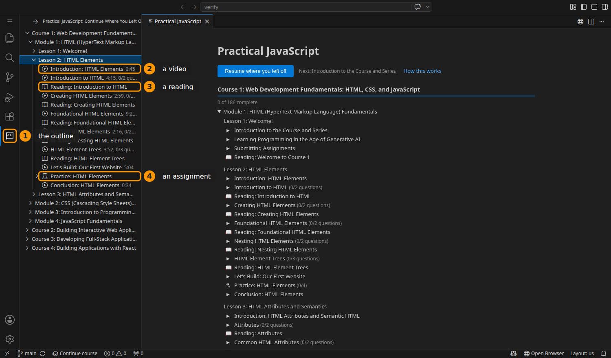
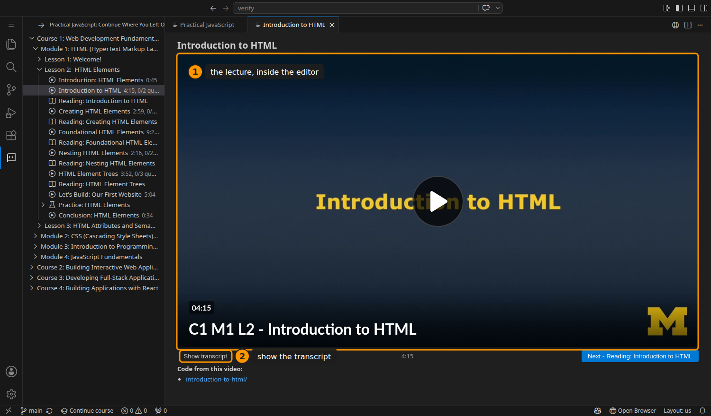
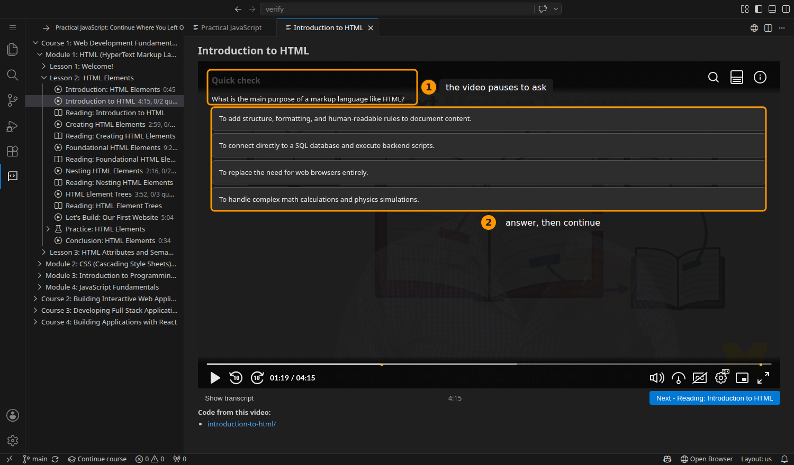
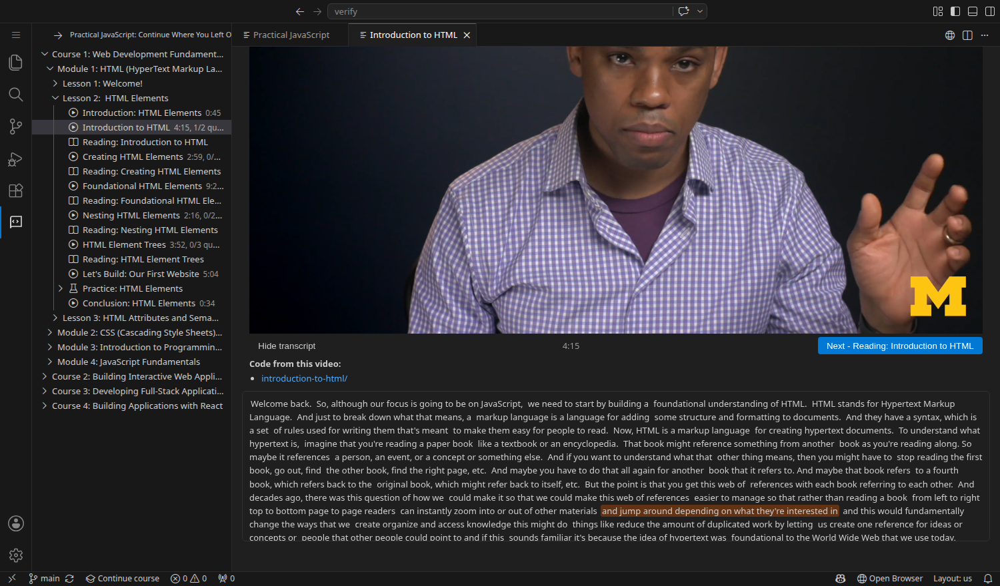
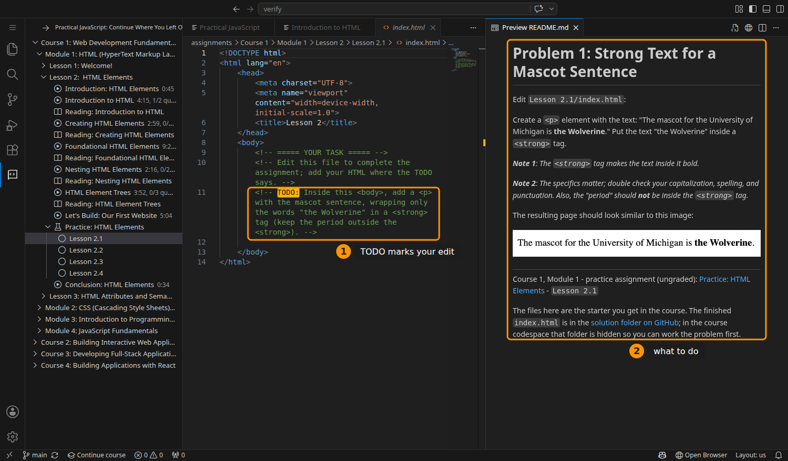
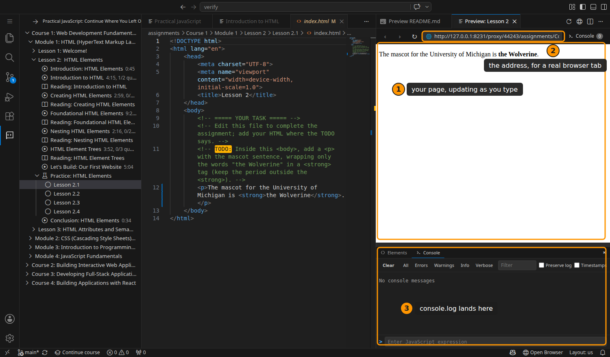
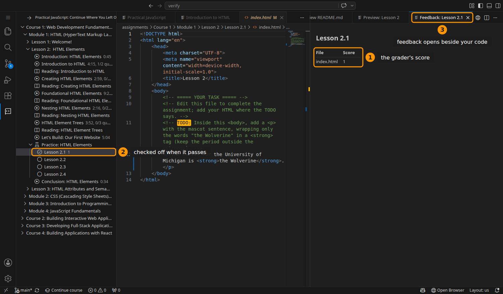

# Working in the Course Codespace

This is the guide to the self-hosted version of the course: the whole
specialization inside a single editor, running on GitHub Codespaces. You watch
the lectures, read the notebooks, write the assignments, and get them graded
without leaving the window.

If you are taking the course on Coursera, you want "Working on the Assignments"
instead. That one covers the Coursera lab and its Submit button. This one covers
the codespace, where the course itself lives in the sidebar and grading happens
through the course's own grader.

## What a codespace is

A codespace is a computer that GitHub runs for you, with the course already on
it. It serves a web version of Visual Studio Code, so the editor in your browser
tab is the same editor professional developers use, and the files you see are on
*GitHub's* machine rather than your own.

Everything you need is installed before you arrive: Node.js, the packages the
Course 3 server assignments import, the notebook engine that makes the lesson
notebooks interactive, and the course companion that puts the outline in your
sidebar.

Two practical notes before you start:

- **Use Chrome or Edge**, or the desktop VS Code app. Safari blocks the parts of
  the editor that render notebooks and previews, and you will see blank panels.
- **Your work is saved automatically** and stays in the codespace between
  visits. Closing the tab does not lose anything.

## Step 1: Start where you left off

When the codespace finishes loading, the course home page opens by itself.



1. **Resume where you left off** opens the first thing you have not finished. On
   your first day that is the opening video; later it is wherever you stopped.
   If you only ever click one button, click this one.
2. **The progress bar** counts everything in the course: videos watched,
   readings opened, and assignment problems passed.
3. **The outline** lists every module. Click one to open it, then click any
   item to jump straight to it.

You can reopen this page at any time from the command palette (`F1`, then type
"Course Home"), and there is a **Continue course** button in the bottom status
bar that does the same thing as Resume.

## Step 2: Find your way around

The course also lives in the sidebar, as a tree you can browse while you work.



1. **The Practical JavaScript icon** in the activity bar (the strip of icons on
   the far left) opens the outline. It stays available no matter what file you
   are editing.
2. **Videos** show their length and how many in-video questions they have, so
   "5:04" tells you what you are committing to.
3. **Readings** are the lesson notebooks: the same text as the course, with code
   you can run and edit in place.
4. **Assignments** expand into one row per problem.

A check mark appears next to anything you finish. Videos check off once you have
watched about ninety percent, readings when you open them, and assignment
problems when the grader passes them.

## Step 3: Watch the lectures

Clicking a video opens the lecture inside the editor.



1. **The lecture itself.** It streams from the University of Michigan's video
   service, the same recording as the Coursera course.
2. **Show transcript** opens the full transcript underneath.

Under the video you will also find **Code from this video**: the exact folder
and files written on camera during that lecture. Clicking a file opens it beside
the video, so you can follow along in the real code instead of retyping from the
screen. The **Next** button at the right of that same bar names whatever comes
after this lecture and takes you there, which is usually its reading.

### In-video questions

Some lectures stop partway through to ask you something.



1. **The question** appears over the paused video.
2. **Pick an answer** and you get feedback right away, plus a **Continue video**
   button to carry on.

These are for you, not for a grade. Nothing is recorded and nothing is reported.
Once you have answered a question it will not interrupt you again, so you can
rewatch a lecture without answering everything twice.

### Following the transcript

The transcript is more than a wall of text: it follows the video as it plays,
and it is clickable.



The line being spoken is highlighted, and clicking any line jumps the video to
that moment. It is the fastest way to find the thirty seconds you actually want
to rewatch, and it is searchable with `Ctrl+F` (`Cmd+F` on a Mac).

## Step 4: Work an assignment

Clicking an assignment problem sets up both halves of the job at once.



1. **The starter file**, with a `TODO:` comment highlighted in yellow marking
   the exact spot you are meant to change. Where a problem has several steps,
   they are numbered `TODO: (1)`, `TODO: (2)`, and so on.
2. **The problem description**, rendered beside your code so you can read the
   requirements without switching tabs.

Two rules that will save you trouble:

- **Edit only the file the description names.** Some problems ship extra files
  the grader depends on.
- **Do not rename or move anything.** The grader looks for files by name and by
  folder, and a renamed file is a missing file.

Your work saves as you type. You do not need to press `Ctrl+S`.

### Seeing your page

For assignments that produce a web page, open a live preview beside your code.



1. **Your page**, redrawn every time you type. Click the preview icon in the
   top-right of the editor, or press `Ctrl+Shift+V` (`Cmd+Shift+V` on a Mac).
   The icon only appears for HTML files: a `.js` or `.css` file has no page of
   its own, so open the `index.html` that loads it and preview from there.
2. **The address bar.** Copy that address into a normal browser tab if you want
   your browser's own developer tools, which are more capable than the panel's.
3. **The console**, where `console.log(...)` output appears. From Course 2
   onward this is the fastest way to answer "is my JavaScript running at all?"

### Assignments that run a server

Course 3 assignments are Node.js programs rather than pages, so you start them
yourself. Open a terminal with **Terminal > New Terminal**, move into the
problem's folder, and run it:

```bash
cd "assignments/Course 3/Module 2/Lesson 1/Lesson 1.1"
node server.js
```

The server prints the address it is listening on, usually
`http://localhost:3000/`, and the codespace offers to open it. **Open in
Browser** gives you a real tab; the address it uses belongs to your codespace,
not to your own machine, so it works from anywhere but stops working when the
codespace shuts down.

A few things worth knowing:

- **Stop the server with `Ctrl+C`.** A running server holds the terminal.
- **Restart it after every change.** Node reads your file once, at startup.
- **`Address already in use`** means an older copy is still running. Stop it
  with `Ctrl+C`, or close the terminal it is in.
- **The packages are already installed.** `express`, `ws`, `lowdb` and the rest
  are there; you do not need to run `npm install`.

## Step 5: Submit for grading

When you are ready, submit from the button in the editor's title bar, or from
the command palette (`F1`, then "Submit Assignment for Grading"). You can also
right-click the problem's folder and submit from there.



1. **Your score.** This is the course's real grader, the same checks the
   Coursera course runs, so a pass here is a genuine pass.
2. **The outline checks the problem off** as soon as it passes.
3. **The feedback panel** opens beside your code. When something fails it names
   the element, the text, or the behavior it expected, and you fix and resubmit.

Grading takes a few seconds, because a real browser opens your page and works
through a list of checks. You can submit as many times as you like, so
submitting a half-finished problem to see which checks pass is a perfectly good
way to work.

**If you are also enrolled on Coursera,** this does not submit there. The
codespace grader tells you whether your work is correct; Coursera's own Submit
button is what earns course credit.

## If something looks wrong

- **Blank panels, or a preview that never appears.** You are probably in Safari.
  Open the codespace in Chrome or Edge instead.
- **The outline is missing.** Click the Practical JavaScript icon in the
  activity bar. If it is not there at all, the extension is still installing;
  wait a few seconds and reload the tab.
- **A video says it is not available.** That lecture has not been published to
  the video service yet. The rest of the lesson still works.
- **Submitting says it cannot reach the grader.** Check your connection and try
  again; the grader wakes up on demand and the very first submission of the day
  can take longer than the rest.

## Where your work lives

Everything you write stays in your codespace, and your progress (what you have
watched, read, and passed) is stored in the editor itself.

If you want a copy on your own computer, right-click any folder in the Explorer
and choose **Download...**. And because a codespace is a real machine, you can
also use `git` in the terminal exactly as you would locally.
